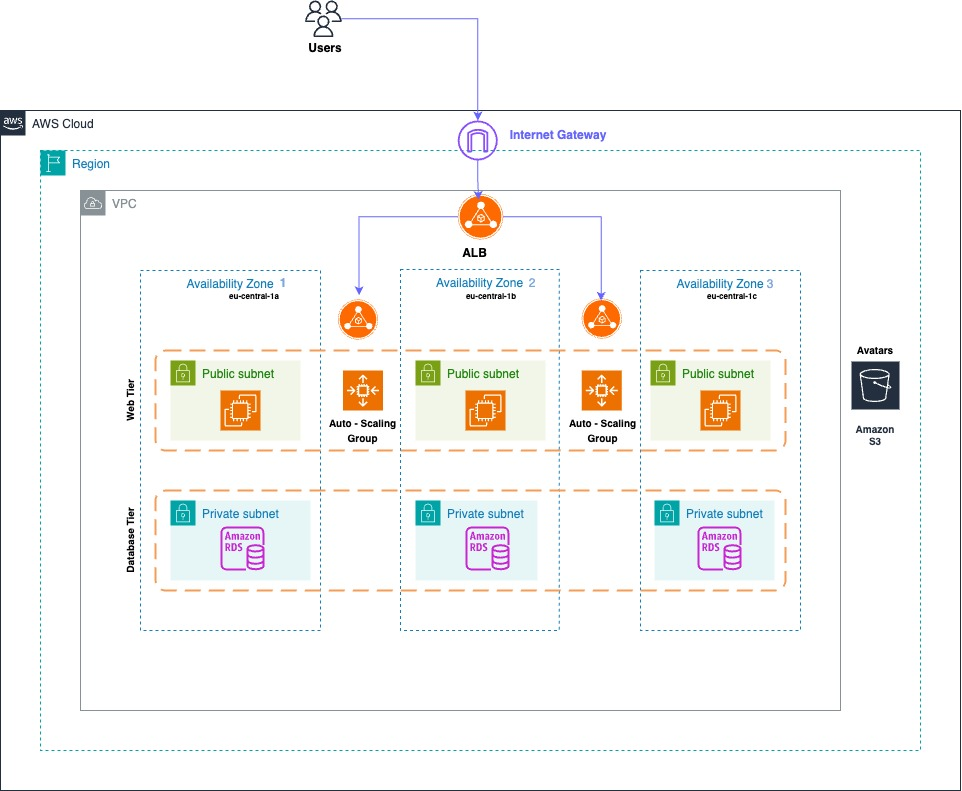
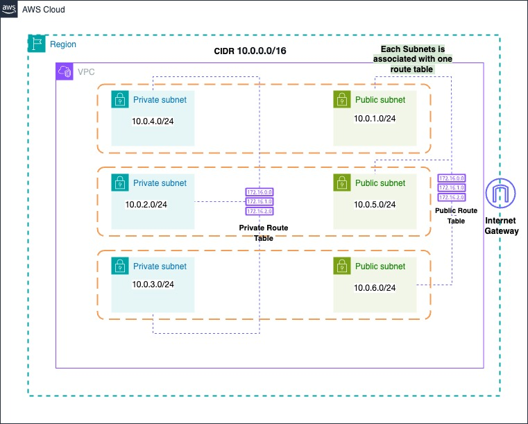

# Guide: Cloud Deployment of the Grocerymate App with AWS, Terraform, and Docker

## 📖 Table of Contents
- [🏁 Introduction](#-introduction)
- [🏗️ Infrastructure Overview](#-infrastructure-overview) 
- [🏛️ Architecture Diagrams](#-architecture-diagrams)
- [🛠️ Terraform Configuration](#-terraform-configuration)
- [[🏗️ Infrastructure Components](#-infrastructure-components)

---
## 🏁 Introduction
The Grocerymate App deployment on cloud is a project from my Cloud Engineering Training from Masterschool.
The application was originally developed by **Alejandro Román**, our Track Mentor (huge thanks to him!). 
My task and focus was to design and deploy its **AWS infrastructure step by step**, implementing each component individually.  

Instead of setting up resource via the console , I used Terraform for full provisioning and deployment of AWS resources, which ensures a **scalable, repeatable, and error-resistant deployment process**, 
eliminating the need for manual configurations.  

For details about the **application's features, functionality, and local installation**, refer to the original [`README.md`](Application.md) by Alejandro.  

This document focuses exclusively on the **AWS infrastructure, deployment process, and automation**.

---
## 🏗️ Infrastructure Overview

This modularized Terraform configuration provisions the infrastructure for a grocery web application using AWS.
The setup includes:
- An auto-scalable high-available Multi-AZ EC2 environment running Dockerized applications.
- A secure PostgreSQL database on RDS with Failover Replica in private subnets.
- A Multi_AZ Application Load Balancer for traffic distribution.
- An S3 bucket for storing user avatars and database dumps.

The infrastructure is designed for **high availability, scalability, and security**.

---
## 🏛️  Architecture Diagrams
**Resource Overview** 

**VPC Routing**

